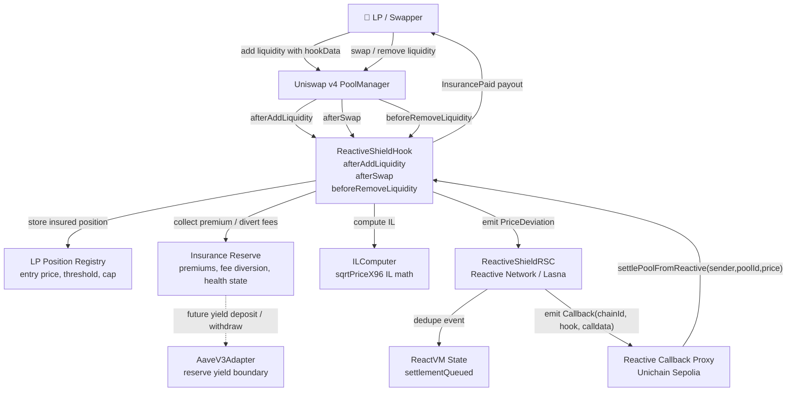
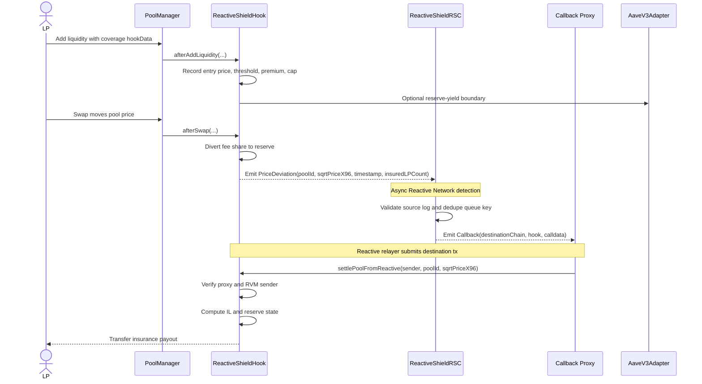
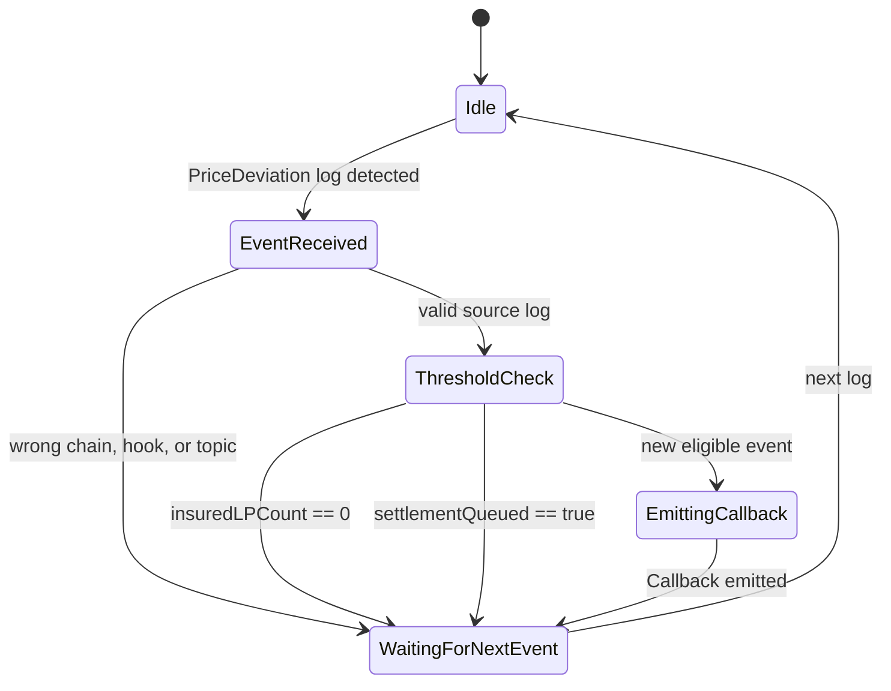
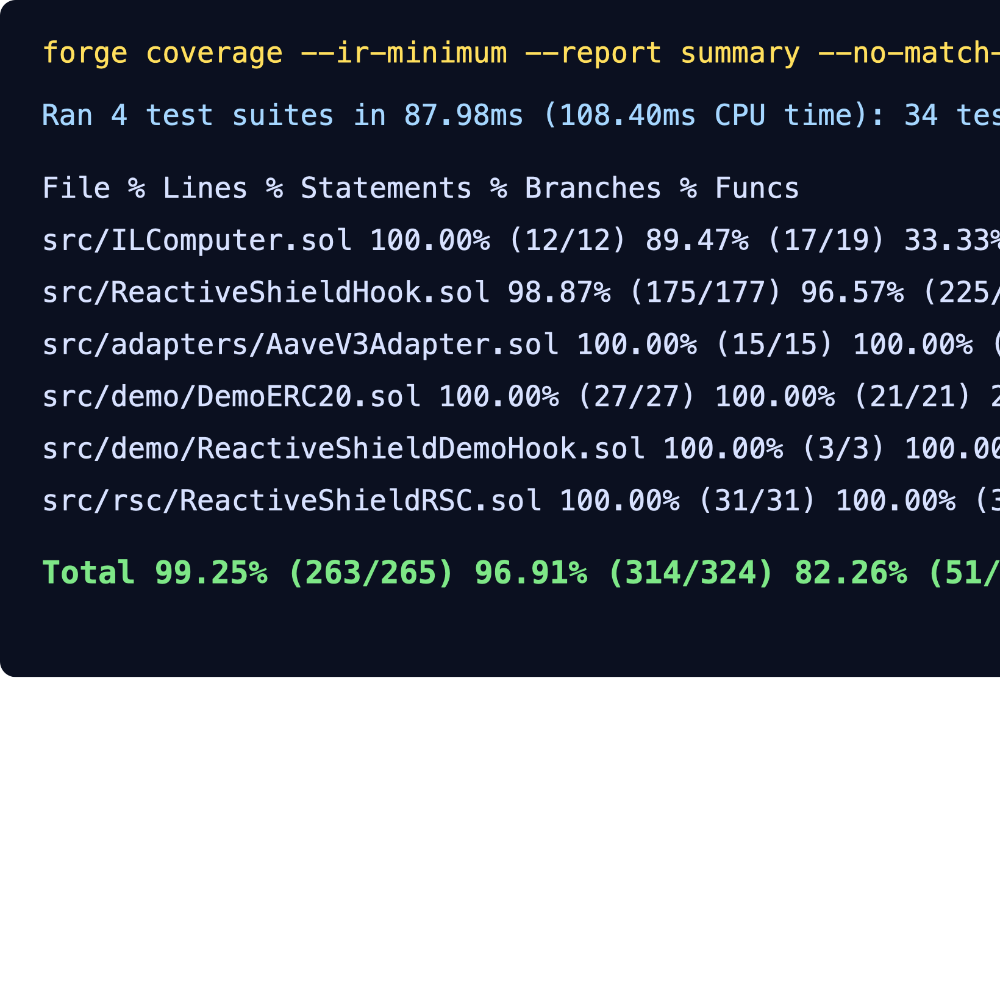

# 🛡️ ReactiveShield

*The pool insures itself; Reactive Network settles the claim.*


---

ReactiveShield is a Uniswap v4 impermanent-loss insurance hook for LPs who want explicit downside protection instead of indirect fee smoothing or off-chain hedging. LPs opt into coverage, pay a premium, and receive reserve-backed payouts when price movement pushes impermanent loss above their selected deductible. Reactive Smart Contracts on Reactive Network monitor hook events and trigger destination callbacks without keepers, bots, multisigs, or manual claims. Built for the UHI9 Hookathon — Impermanent Loss & Yield Systems.

> ⚛️ **Reactive Network Integration**  
> ReactiveShield is powered by Reactive Smart Contracts (RSCs) deployed on Reactive Network. RSCs autonomously monitor on-chain events from Uniswap v4 and trigger callbacks without keepers, bots, or manual intervention. In ReactiveShield, the RSC subscribes to `PriceDeviation` events, queues one settlement per observed price event, and calls the hook back through the Reactive callback proxy to settle eligible insured LPs.

## Table of Contents

- [The Problem](#the-problem)
- [The Solution](#the-solution)
- [Architecture](#architecture)
- [Core Components](#core-components)
- [Reactive Network Integration](#reactive-network-integration)
- [Demo Run](#demo-run)
- [Test Coverage](#test-coverage)
- [Local Development](#local-development)
- [Contributing & License](#contributing--license)
- [Acknowledgements](#acknowledgements)

## The Problem

Impermanent loss is a persistent cost for Uniswap LPs. A liquidity provider can be directionally correct about market demand and still lose value relative to simply holding the underlying tokens when the pool price moves sharply. Concentrated liquidity makes this harder: capital efficiency rises, but price movement can amplify inventory drift and make LP outcomes harder to explain.

Most previous approaches manage IL indirectly. FlexFee-style dynamic fee systems reprice volatility risk, Gainswap-style designs invert or hedge IL exposure, xtreamly explored off-chain delta hedging, Idle Liquidity Yield Hook optimizes unused capital, and YieldSync targets LST-specific drift. These are useful designs, but they generally smooth, shift, or hedge the loss rather than creating a separate reserve that pays LPs when covered IL actually occurs.

ReactiveShield fills the insurance gap: a pool-native mutual reserve funded by LP premiums and fee diversion, with autonomous claim settlement triggered by Reactive Network. The hook makes risk explicit: LPs choose a deductible, the reserve absorbs eligible loss above that threshold, and circuit breakers constrain payouts when reserves are stressed.

**ReactiveShield solves this by combining opt-in LP coverage, reserve-backed payouts, and RSC-triggered settlement for Uniswap v4 liquidity positions.**

## The Solution

ReactiveShield turns IL protection into a transparent on-chain insurance product. LPs enroll a position with a threshold, the hook records their entry price and coverage cap, and the reserve grows from premiums plus fee diversion. When pool price movement implies IL above the deductible, the Reactive Smart Contract emits a callback that asks the hook to settle eligible positions.

The live demo uses a deterministic demo hook event to prove the full origin-chain → Lasna RVM → destination-chain callback path. The production hook contains the same accounting primitives: enrollment, reserve health states, payout caps, callback authentication, epoch gating, and final settlement on withdrawal.

1. The LP enrolls a position, chooses a threshold between `2%` and `20%`, and pays a `0.5%` premium.
2. The hook records entry `sqrtPriceX96`, position value, premium paid, epoch, and maximum coverage.
3. Swaps or demo events update the pool price and emit `PriceDeviation(bytes32,uint160,uint256,uint256)`.
4. ReactiveShieldRSC receives the event on ReactVM and queues a settlement callback for that pool and observed price.
5. Reactive Network relays the callback to the destination hook through the callback proxy.
6. The hook verifies both the callback proxy and RVM sender, computes excess IL, and pays the LP from the reserve.
7. If the reserve is stressed or depleted, payouts are reduced or paused and fee diversion increases to recover reserve health.

> ⚖️ **Risk Accounting:** The insurance reserve absorbs LP impermanent loss above the chosen deductible up to each position's coverage cap; LPs absorb loss below the deductible, loss above the cap, and loss during depleted-reserve circuit breaker periods.

## Architecture







## Core Components

### ReactiveShieldHook.sol

`ReactiveShieldHook.sol` is the main Uniswap v4 hook that records insured LP positions, manages reserve accounting, emits price-deviation events, authenticates Reactive callbacks, and pays eligible claims.

| Function | Visibility | Description |
| --- | --- | --- |
| `getHookPermissions()` | `public pure` | Enables `afterAddLiquidity`, `afterSwap`, and `beforeRemoveLiquidity`. |
| `configurePool(bytes32,address,uint256,uint160)` | `external` | Initializes pool insurance token, reserve target, fee diversion, and starting price. |
| `fundReserve(bytes32,uint256)` | `external` | Pulls token1 into the hook and credits the pool insurance reserve. |
| `enrollPosition(bytes32,address,address,uint160,uint256,uint256)` | `external` | Enrolls an LP, collects premium, records entry price, and sets max coverage. |
| `getInsuredLPs(bytes32)` | `external view` | Returns the covered LP list for a pool. |
| `callbackDebt()` | `public view` | Reads Reactive callback proxy debt for this hook. |
| `coverCallbackDebt()` | `external` | Pays outstanding callback debt from the hook's native balance. |
| `settlePoolFromReactive(address,bytes32,uint160)` | `external` | Reactive callback entry point for pool-level settlement. |
| `triggerPayoutFromReactive(address,bytes32,address,uint256)` | `external` | Reactive callback entry point for a single LP payout. |
| `triggerSettlement(bytes32,uint160)` | `external` | Permissionless fallback settlement path for demos and recovery. |

| Variable | Type | Description |
| --- | --- | --- |
| `callbackProxy` | `address immutable` | Reactive callback proxy allowed to call Reactive settlement functions. |
| `reactiveSender` | `address immutable` | Expected RVM sender encoded in Reactive callback calldata. |
| `epochLength` | `uint256 immutable` | Minimum epoch gate used for payout timing. |
| `poolState` | `mapping(bytes32 => PoolInsuranceState)` | Reserve, fee diversion, token, and price state per pool. |
| `positions` | `mapping(bytes32 => mapping(address => InsuredPosition))` | Insured LP position records. |
| `insuredLPs` | `address[] per pool` | LP list used for settlement iteration. |
| `insuredIndexPlusOne` | `mapping` | Swap-and-pop index tracking for LP removal. |

Hook permissions:

- ❌ `beforeInitialize`
- ❌ `afterInitialize`
- ❌ `beforeAddLiquidity`
- ✅ `afterAddLiquidity`
- ✅ `beforeRemoveLiquidity`
- ❌ `afterRemoveLiquidity`
- ❌ `beforeSwap`
- ✅ `afterSwap`
- ❌ `beforeDonate`
- ❌ `afterDonate`
- ❌ `beforeSwapReturnDelta`
- ❌ `afterSwapReturnDelta`
- ❌ `afterAddLiquidityReturnDelta`
- ❌ `afterRemoveLiquidityReturnDelta`

### ReactiveShieldRSC.sol

`ReactiveShieldRSC.sol` is the Reactive Smart Contract deployed on Lasna that subscribes to hook price events and emits settlement callbacks.

| Item | Detail |
| --- | --- |
| Subscription event | `PriceDeviation(bytes32,uint160,uint256,uint256)` |
| Origin chain | Unichain Sepolia, chain ID `1301` |
| Destination chain | Unichain Sepolia, chain ID `1301` |
| Origin contract | Demo hook `0xC890A568b2BCedF0dBF80b40e0D1D31CBfac0640` |
| Callback emitted | `settlePoolFromReactive(address,bytes32,uint160)` |
| Callback gas limit | `1_500_000` |

`react()` validates the event source, decodes `poolId`, `sqrtPriceX96`, `observedAt`, and `insuredLPCount`, skips empty pools, deduplicates by `keccak256(poolId, sqrtPriceX96, observedAt)`, and emits a Reactive callback to the hook.

### ILComputer.sol

`ILComputer.sol` is a pure math library that computes impermanent loss in basis points from Uniswap `sqrtPriceX96` values.

| Function | Visibility | Description |
| --- | --- | --- |
| `computeILBps(uint160,uint160)` | `internal pure` | Computes IL using `1 - 2*sqrt(k)/(1+k)`. |
| `excessILBps(uint160,uint160,uint256)` | `internal pure` | Returns total IL and IL above a threshold. |

### AaveV3Adapter.sol

`AaveV3Adapter.sol` is an adapter boundary for reserve yield. It supports Aave v3 supply, withdraw, current aToken balance reads, and yield harvesting; it is implemented and tested, but not part of the latest live Unichain Sepolia demo proof.

### DemoERC20.sol

`DemoERC20.sol` is the testnet reserve token used in the live demo run. It implements minting, approvals, transfers, and `transferFrom` behavior needed by the hook.

### ReactiveShieldDemoHook.sol

`ReactiveShieldDemoHook.sol` extends the main hook with `emitDemoPriceDeviation(bytes32,uint160)` so judges can trigger a deterministic Reactive event without relying on live pool volume.

## Reactive Network Integration

### Why Reactive Network?

IL insurance settlement is event-driven and asynchronous: a pool price update can make many LPs eligible for payout, but no EVM transaction runs automatically unless an actor submits it. Reactive Network is the right architecture because the RSC subscribes to hook events, executes deterministic ReactVM logic, and emits a destination callback without an off-chain keeper or user claim transaction. This gives judges a three-part proof: origin event, Lasna RVM processing, and destination payout.

### RSC Event Subscription

```solidity
// Event emitted by hook
event PriceDeviation(
    bytes32 indexed poolId,
    uint160 sqrtPriceX96,
    uint256 timestamp,
    uint256 insuredLPCount
);

// Topic0 used for RSC subscription
bytes32 topic0 = keccak256("PriceDeviation(bytes32,uint160,uint256,uint256)");
```

The live RSC subscribes to the demo hook on Unichain Sepolia. The latest run verified `subscriptionConfigured == true` and one active RNK filter for the origin chain, hook address, event topic, RSC address, and RVM id.

### ReactVM Computation

ReactVM state:

| State | Type | Purpose |
| --- | --- | --- |
| `settlementQueued` | `mapping(bytes32 => bool)` | Prevents duplicate settlement callbacks for the same pool, observed price, and timestamp. |
| `PRICE_DEVIATION_TOPIC0` | `uint256 immutable` | Ensures the RSC only reacts to the hook's intended event. |
| `CALLBACK_SENDER` | `address immutable` | Explicit RVM sender encoded into callback calldata. |

```solidity
function react(LogRecord calldata log) external vmOnly override {
    if (
        log.chain_id != ORIGIN_CHAIN_ID ||
        log._contract != HOOK_ADDRESS ||
        log.topic_0 != PRICE_DEVIATION_TOPIC0
    ) {
        return;
    }

    bytes32 poolId = bytes32(log.topic_1);
    (uint160 sqrtPriceX96, uint256 observedAt, uint256 insuredLPCount) =
        abi.decode(log.data, (uint160, uint256, uint256));

    if (insuredLPCount == 0) {
        emit PriceDeviationIgnored(poolId, "NO_INSURED_LPS");
        return;
    }

    bytes32 queueKey = keccak256(abi.encode(poolId, sqrtPriceX96, observedAt));
    if (settlementQueued[queueKey]) {
        emit PriceDeviationIgnored(poolId, "ALREADY_QUEUED");
        return;
    }
    settlementQueued[queueKey] = true;

    bytes memory payload = abi.encodeWithSignature(
        "settlePoolFromReactive(address,bytes32,uint160)",
        CALLBACK_SENDER,
        poolId,
        sqrtPriceX96
    );
    emit Callback(DESTINATION_CHAIN_ID, HOOK_ADDRESS, CALLBACK_GAS_LIMIT, payload);
}
```

### Callback Flow

```text
Unichain Sepolia hook emits PriceDeviation
    -> ReactiveShieldRSC detects event on Reactive Network
    -> react() executes on ReactVM
    -> RSC emits Callback(chainId, hookAddress, calldata)
    -> Reactive Network relayer submits destination tx
    -> Hook settlePoolFromReactive(sender,poolId,sqrtPriceX96) executes on Unichain Sepolia
    -> Hook emits InsurancePaid when an LP is eligible
```

### Access Control

ReactiveShield uses two checks on callback entry points: the immediate caller must be the destination callback proxy, and the encoded sender must match the authorized RVM sender.

```solidity
function settlePoolFromReactive(
    address sender,
    bytes32 poolId,
    uint160 currentSqrtPriceX96
) external {
    if (msg.sender != callbackProxy) revert NotReactiveCallback();
    if (sender != reactiveSender) revert InvalidReactiveSender();
    _settlePool(poolId, currentSqrtPriceX96);
}

function triggerPayoutFromReactive(
    address sender,
    bytes32 poolId,
    address lp,
    uint256 excessILBps
) external {
    if (msg.sender != callbackProxy) revert NotReactiveCallback();
    if (sender != reactiveSender) revert InvalidReactiveSender();
    _processPayout(poolId, lp, excessILBps, 0);
}
```

## Demo Run

The demo script tests the full end-to-end lifecycle: Reactive preflight, LP asset setup, insurance enrollment, reserve funding, epoch gating, origin `PriceDeviation`, Lasna RVM processing, and destination `InsurancePaid` payout. It uses already deployed Unichain Sepolia and Lasna contracts and prints every transaction hash with an explorer URL.

### Deployed Contracts

| Contract | Address | Explorer |
| --- | --- | --- |
| Production Hook | `0x7B01bb0a1fF1b937B836E656C2F4274708f64640` | [View on Explorer](https://sepolia.uniscan.xyz/address/0x7B01bb0a1fF1b937B836E656C2F4274708f64640) |
| Production RSC | `0x289796af51c6fD3D44f73b5022cC24447055b7EB` | [View on Explorer](https://lasna.reactscan.net/address/0x289796af51c6fD3D44f73b5022cC24447055b7EB) |
| Demo Token | `0xe5Bdc98BA55C0257782Eab836f49569c31199A25` | [View on Explorer](https://sepolia.uniscan.xyz/address/0xe5Bdc98BA55C0257782Eab836f49569c31199A25) |
| Demo Hook | `0xC890A568b2BCedF0dBF80b40e0D1D31CBfac0640` | [View on Explorer](https://sepolia.uniscan.xyz/address/0xC890A568b2BCedF0dBF80b40e0D1D31CBfac0640) |
| Demo RSC | `0xA05b0fFc30482bF4923A6C0BdC321edB0179B395` | [View on Explorer](https://lasna.reactscan.net/address/0xA05b0fFc30482bF4923A6C0BdC321edB0179B395) |
| Callback Proxy | `0x9299472A6399Fd1027ebF067571Eb3e3D7837FC4` | [View on Explorer](https://sepolia.uniscan.xyz/address/0x9299472A6399Fd1027ebF067571Eb3e3D7837FC4) |
| RVM Sender / ID | `0x4b992F2Fbf714C0fCBb23baC5130Ace48CaD00cd` | [View on Explorer](https://lasna.reactscan.net/address/0x4b992F2Fbf714C0fCBb23baC5130Ace48CaD00cd) |

### End-to-End Demo Steps

#### Step 1 — Fund Callback Debt Balance

**Action:** Send native token to the hook so it can pay outstanding Reactive callback proxy debt.  
**Expected:** Hook has enough balance to clear callback debt.  
**Result:** ✅ Hook received debt-cover funding.  
**Transaction:** [`0x5e62...0fee`](https://sepolia.uniscan.xyz/tx/0x5e621c763052e7f54bf1b0f3f5124860121bf833d594a378701c731a37a20fee)

#### Step 2 — Cover Callback Debt

**Action:** Call `coverCallbackDebt()` on the hook.  
**Expected:** `callbackDebt()` returns `0`, so the Reactive relay path is not blocked by unpaid callback debt.  
**Result:** ✅ Callback debt was cleared.  
**Transaction:** [`0xa139...9184`](https://sepolia.uniscan.xyz/tx/0xa139d855d8c27eee16a1370bcf84a530ca81ce021ba881e3250d3a5e975d9184)

#### Step 3 — Mint Demo Reserve Token

**Action:** Mint demo quote/reserve tokens to the LP account.  
**Expected:** The LP has enough token balance to pay premium and seed the reserve.  
**Result:** ✅ Demo tokens minted.  
**Transaction:** [`0x5094...ef7a`](https://sepolia.uniscan.xyz/tx/0x5094c4ec03528d306f58b4b911b5fb2fc3693014e5a03ce1d3631fa03d53ef7a)

#### Step 4 — Approve Hook

**Action:** Approve the hook to pull the demo token.  
**Expected:** The hook can collect premiums and reserve funding.  
**Result:** ✅ Hook approval succeeded.  
**Transaction:** [`0x70d4...eb14`](https://sepolia.uniscan.xyz/tx/0x70d498c5ce09acb752081a849a082bebfd853f367483eefb3456d0db3fddeb14)

#### Step 5 — Enroll Insured LP

**Action:** Call `enrollPosition(...)` with a 5% deductible threshold.  
**Expected:** The hook records the LP's entry price, threshold, premium, coverage cap, and active coverage.  
**Result:** ✅ LP enrolled in coverage.  
**Transaction:** [`0xd0ee...0204`](https://sepolia.uniscan.xyz/tx/0xd0ee318d72ba91cc9839abfe2bcb555549b845aedf55823ff692d7a5a5310204)

#### Step 6 — Fund Insurance Reserve

**Action:** Call `fundReserve(...)` for the demo pool.  
**Expected:** The pool reserve has enough token balance to pay a covered claim.  
**Result:** ✅ Reserve funded.  
**Transaction:** [`0x5429...9baf`](https://sepolia.uniscan.xyz/tx/0x5429f2de287eeea3c517fd6fb1ec352e5a0023ac19705786da7f67594b269baf)

#### Step 7 — Emit Origin PriceDeviation

**Action:** Call `emitDemoPriceDeviation(poolId, sqrtPriceX96)` after the demo epoch gate.  
**Expected:** The hook emits `PriceDeviation`, giving Reactive Network a source event to process.  
**Result:** ✅ Origin event emitted on Unichain Sepolia.  
**Transaction:** [`0xe2f1...c016`](https://sepolia.uniscan.xyz/tx/0xe2f16a740ac8879c4f9b53acd9529779e47a1817a5f5ea71f196ee27ed09c016)

#### Step 8 — Observe Destination InsurancePaid Callback

**Action:** Poll the LP token balance and `InsurancePaid` logs after the origin event.  
**Expected:** Reactive callback proxy calls the hook, the hook verifies proxy and sender, and LP balance increases.  
**Result:** ✅ Destination payout observed on attempt 2.  
**Transaction:** [`0xaac3...7d4c`](https://sepolia.uniscan.xyz/tx/0xaac30bf3ea6b9099857b6c1d007f3658fc9a2326756d91a24669ff478daf7d4c)

#### Step 9 — Verify Lasna RVM Processing

**Action:** Poll RNK transactions near the RVM tail and match `refTx` to the origin event transaction.  
**Expected:** Lasna shows an RVM tx processing the exact origin `PriceDeviation` transaction.  
**Result:** ✅ RVM processing proof found.  
**Transaction:** [`0xe3d6...1b7f`](https://lasna.reactscan.net/tx/0xe3d654e3b26f73356bd7925f9bea4f101714478f34fd3206f2e04e8d79301b7f)

### Demo Output

```bash
ReactiveShield Unichain Sepolia <-> Lasna demo e2e
Purpose: prove the full LP insurance journey plus the three Reactive proof layers.
User story: an LP opts into IL insurance, the pool reserve is funded, a price deviation is emitted, Lasna reacts, and the destination hook pays the LP automatically.
Deployer: 0x4b992F2Fbf714C0fCBb23baC5130Ace48CaD00cd
Demo token: 0xe5Bdc98BA55C0257782Eab836f49569c31199A25
Demo hook: 0xC890A568b2BCedF0dBF80b40e0D1D31CBfac0640
Demo RSC: 0xA05b0fFc30482bF4923A6C0BdC321edB0179B395
Callback proxy: 0x9299472A6399Fd1027ebF067571Eb3e3D7837FC4
RVM sender/id: 0x4b992F2Fbf714C0fCBb23baC5130Ace48CaD00cd
Pool id: 0xc6ef21afddc4b16eb5292fa9ac8a9cc29f1b36a8b48b1fceddcbf56efe56a94b

Proof model:
  1. Origin chain: Unichain Sepolia transaction emits PriceDeviation.
  2. Reactive layer: Lasna RVM transaction processes that exact origin tx.
  3. Destination chain: callback proxy submits a payout tx that emits InsurancePaid.

Phase 1: verify live callback proxy, RVM sender, subscription, filter, and callback debt
What this proves: the deployed hook trusts the expected callback proxy and RVM sender, the RSC is subscribed to this hook's PriceDeviation topic, and callback payment debt will not block the relay.
Hook callback proxy: 0x9299472A6399Fd1027ebF067571Eb3e3D7837FC4
Hook reactive sender: 0x4b992F2Fbf714C0fCBb23baC5130Ace48CaD00cd
RSC subscribed hook: 0xC890A568b2BCedF0dBF80b40e0D1D31CBfac0640
RSC origin chain: 1301
RSC destination chain: 1301
subscriptionConfigured: true
active RNK filter matches: 1
callbackDebt: 384462225000
Callback debt is nonzero; funding hook and calling coverCallbackDebt()
Fund hook native debt balance tx: 0x5e621c763052e7f54bf1b0f3f5124860121bf833d594a378701c731a37a20fee
Fund hook native debt balance url: https://sepolia.uniscan.xyz/tx/0x5e621c763052e7f54bf1b0f3f5124860121bf833d594a378701c731a37a20fee
Cover callback debt retry 1: RPC returned nonce too low; waiting for nonce indexer
Cover callback debt tx: 0xa139d855d8c27eee16a1370bcf84a530ca81ce021ba881e3250d3a5e975d9184
Cover callback debt url: https://sepolia.uniscan.xyz/tx/0xa139d855d8c27eee16a1370bcf84a530ca81ce021ba881e3250d3a5e975d9184
callbackDebt after cover: 0

Phase 1 result: Reactive preflight passed. A live Lasna filter is active for this hook/topic/RVM tuple.

Phase 2: mint demo reserve token and approve hook
User perspective: the demo account receives quote/reserve tokens and grants the hook allowance so it can collect the LP premium and reserve seed.
Mint demo token tx: 0x5094c4ec03528d306f58b4b911b5fb2fc3693014e5a03ce1d3631fa03d53ef7a
Mint demo token url: https://sepolia.uniscan.xyz/tx/0x5094c4ec03528d306f58b4b911b5fb2fc3693014e5a03ce1d3631fa03d53ef7a
Approve hook tx: 0x70d498c5ce09acb752081a849a082bebfd853f367483eefb3456d0db3fddeb14
Approve hook url: https://sepolia.uniscan.xyz/tx/0x70d498c5ce09acb752081a849a082bebfd853f367483eefb3456d0db3fddeb14

Phase 2 result: the LP account has spendable demo assets and the hook is approved.

Phase 3: enroll insured LP and seed reserve
User perspective: the LP opts into insurance with a 5% IL deductible. The hook records entry price, position value, premium, coverage cap, and active coverage.
Protocol perspective: the reserve is funded so an eligible Reactive payout has capital available.
Enroll insured LP tx: 0xd0ee318d72ba91cc9839abfe2bcb555549b845aedf55823ff692d7a5a5310204
Enroll insured LP url: https://sepolia.uniscan.xyz/tx/0xd0ee318d72ba91cc9839abfe2bcb555549b845aedf55823ff692d7a5a5310204
Fund reserve tx: 0x5429f2de287eeea3c517fd6fb1ec352e5a0023ac19705786da7f67594b269baf
Fund reserve url: https://sepolia.uniscan.xyz/tx/0x5429f2de287eeea3c517fd6fb1ec352e5a0023ac19705786da7f67594b269baf

Phase 3 result: coverage is active and the insurance reserve is funded.

Phase 4: wait for demo epoch gate
What this proves: payouts are epoch-gated, so the demo waits until the minimum coverage period has elapsed before trying to claim.
epoch wait complete

Phase 5: emit origin PriceDeviation event from demo hook
What this proves: an origin-chain event exists for Reactive Network to observe. This is not a payout yet; it is only the source signal.
Origin PriceDeviation tx: 0xe2f16a740ac8879c4f9b53acd9529779e47a1817a5f5ea71f196ee27ed09c016
Origin PriceDeviation url: https://sepolia.uniscan.xyz/tx/0xe2f16a740ac8879c4f9b53acd9529779e47a1817a5f5ea71f196ee27ed09c016

Phase 5 result: origin event transaction submitted. This tx is the anchor used to find the Lasna RVM processing tx.

Phase 6: poll destination payout
What this proves: the Reactive callback proxy eventually calls the destination hook, the hook verifies proxy + RVM sender, and the LP receives an insurance payout.
Attempt 1: no destination payout yet
Payout observed on attempt 2
Balance before: 384992000000000000000000 [3.849e23]
Balance after:  385063000000000000000000 [3.85e23]
Destination InsurancePaid tx: 0xaac30bf3ea6b9099857b6c1d007f3658fc9a2326756d91a24669ff478daf7d4c
Destination InsurancePaid url: https://sepolia.uniscan.xyz/tx/0xaac30bf3ea6b9099857b6c1d007f3658fc9a2326756d91a24669ff478daf7d4c

Phase 6 result: destination callback/payout proof collected.

Phase 7: poll Lasna RVM processing tx
What this proves: Lasna processed the exact origin PriceDeviation tx and queued the callback. This is the Reactive Network proof layer between origin and destination.
Lasna RVM processing tx: 0xe3d654e3b26f73356bd7925f9bea4f101714478f34fd3206f2e04e8d79301b7f
Lasna RVM processing url: https://lasna.reactscan.net/tx/0xe3d654e3b26f73356bd7925f9bea4f101714478f34fd3206f2e04e8d79301b7f

Phase 7 result: RVM processing proof collected.

Phase 8: proof summary
Read this section as the judge/user proof trail:
  - Mint/approve/enroll/fund show the user's setup and reserve funding.
  - Origin event shows the hook emitted PriceDeviation on Unichain Sepolia.
  - RVM processing shows Lasna observed and reacted to that origin tx.
  - Destination callback shows the hook paid the insured LP through the Reactive relay.
Mint url: https://sepolia.uniscan.xyz/tx/0x5094c4ec03528d306f58b4b911b5fb2fc3693014e5a03ce1d3631fa03d53ef7a
Approve url: https://sepolia.uniscan.xyz/tx/0x70d498c5ce09acb752081a849a082bebfd853f367483eefb3456d0db3fddeb14
Enroll url: https://sepolia.uniscan.xyz/tx/0xd0ee318d72ba91cc9839abfe2bcb555549b845aedf55823ff692d7a5a5310204
Fund reserve url: https://sepolia.uniscan.xyz/tx/0x5429f2de287eeea3c517fd6fb1ec352e5a0023ac19705786da7f67594b269baf
Origin event url: https://sepolia.uniscan.xyz/tx/0xe2f16a740ac8879c4f9b53acd9529779e47a1817a5f5ea71f196ee27ed09c016
RVM processing url: https://lasna.reactscan.net/tx/0xe3d654e3b26f73356bd7925f9bea4f101714478f34fd3206f2e04e8d79301b7f
Destination callback url: https://sepolia.uniscan.xyz/tx/0xaac30bf3ea6b9099857b6c1d007f3658fc9a2326756d91a24669ff478daf7d4c
Destination payout observed: true
```

## Test Coverage

This project targets exhaustive test coverage across all contracts; the latest verified Foundry run reports `99.25%` line coverage and `100.00%` function coverage under `--ir-minimum`.

### Coverage Report

```text
Ran 4 test suites in 87.98ms (108.40ms CPU time): 34 tests passed, 0 failed, 0 skipped (34 total tests)

╭-------------------------------------+------------------+------------------+----------------+-----------------╮
| File                                | % Lines          | % Statements     | % Branches     | % Funcs         |
+==============================================================================================================+
| src/ILComputer.sol                  | 100.00% (12/12)  | 89.47% (17/19)   | 33.33% (1/3)   | 100.00% (2/2)   |
|-------------------------------------+------------------+------------------+----------------+-----------------|
| src/ReactiveShieldHook.sol          | 98.87% (175/177) | 96.57% (225/233) | 89.80% (44/49) | 100.00% (27/27) |
|-------------------------------------+------------------+------------------+----------------+-----------------|
| src/adapters/AaveV3Adapter.sol      | 100.00% (15/15)  | 100.00% (14/14)  | 100.00% (1/1)  | 100.00% (5/5)   |
|-------------------------------------+------------------+------------------+----------------+-----------------|
| src/demo/DemoERC20.sol              | 100.00% (27/27)  | 100.00% (21/21)  | 20.00% (1/5)   | 100.00% (6/6)   |
|-------------------------------------+------------------+------------------+----------------+-----------------|
| src/demo/ReactiveShieldDemoHook.sol | 100.00% (3/3)    | 100.00% (2/2)    | 100.00% (0/0)  | 100.00% (1/1)   |
|-------------------------------------+------------------+------------------+----------------+-----------------|
| src/rsc/ReactiveShieldRSC.sol       | 100.00% (31/31)  | 100.00% (35/35)  | 100.00% (4/4)  | 100.00% (3/3)   |
|-------------------------------------+------------------+------------------+----------------+-----------------|
| Total                               | 99.25% (263/265) | 96.91% (314/324) | 82.26% (51/62) | 100.00% (44/44) |
╰-------------------------------------+------------------+------------------+----------------+-----------------╯
```

### Coverage Screenshot



Add screenshot of forge coverage terminal output as `assets/coverage.png` in repo.

### Test Suite Summary

| Test File | Tests | Coverage |
| --- | ---: | --- |
| `test/ReactiveShieldHook.t.sol` | 23 | Main hook functions covered; `100%` hook function coverage. |
| `test/ReactiveShieldRSC.t.sol` | 6 | `100%` RSC line, statement, branch, and function coverage. |
| `test/AdapterAndDemo.t.sol` | 3 | Adapter and demo contracts covered. |
| `test/ILComputer.t.sol` | 2 | Pure IL math covered with known-value and fuzz tests. |

Total: `34` tests passing · `99.25%` line · `82.26%` branch · `100.00%` function.

```bash
forge test --match-path "test/**" -vvv
```

```bash
forge coverage --ir-minimum --report summary --no-match-coverage "^(script|test)/"
```

Plain `forge coverage` currently hits a Solidity stack-too-deep path; the verified coverage command uses Foundry's `--ir-minimum` workaround.

## Local Development

### Prerequisites

```bash
# Required
forge --version    # Foundry
node --version     # Node.js for frontend and helper scripts
jq --version       # JSON parsing used by live demo script
cast --version     # Foundry cast CLI
```

### Installation

```bash
git clone https://github.com/najnomics/reactive-shield
cd reactive-shield
git submodule update --init --recursive
forge install Reactive-Network/reactive-lib
forge build
```

### Environment Setup

```bash
cp .env.example .env
# Fill in:
# PRIVATE_KEY=
# UNICHAIN_SEPOLIA_RPC_URL=
# REACTIVE_LASNA_RPC_URL=https://lasna-rpc.rnk.dev/
# REACTIVE_SYSTEM_CONTRACT=0x0000000000000000000000000000000000fffFfF
# REACTIVE_SHIELD_DEMO_HOOK_ADDRESS=
# REACTIVE_SHIELD_DEMO_RSC_ADDRESS=
# REACTIVE_SHIELD_RVM_ID=
```

### Run Tests

```bash
forge test -vvv
```

### Deploy

```bash
# Deploy destination hook and related demo contracts
forge script script/DeployReactiveShieldDestination.s.sol --rpc-url $UNICHAIN_SEPOLIA_RPC_URL --broadcast

# Deploy RSC on Reactive Lasna
forge script script/DeployReactiveShieldRSC.s.sol --rpc-url $REACTIVE_LASNA_RPC_URL --broadcast
```

### Run Demo

```bash
./script/e2e-unichain-lasna-demo.sh
```

## Contributing & License

Contributions should follow the standard fork, branch, and pull request flow:

1. Fork the repository.
2. Create a feature branch.
3. Add or update tests for every behavior change.
4. Run `forge test -vvv` and the coverage command before opening a PR.
5. Open a PR with a concise description of the change, test results, and any deployment impact.

ReactiveShield is released under the MIT License. See [`LICENSE`](./LICENSE).

## Acknowledgements

- Uniswap Hook Incubator UHI9 and Atrium Academy for the Impermanent Loss & Yield Systems track.
- Reactive Network team for Lasna, `reactive-lib`, callback proxy support, and RNK tooling.
- Uniswap v4 contributors for PoolManager, hook interfaces, and the v4 hook development model.
- Prior UHI hooks and projects including FlexFee, Gainswap, xtreamly, Idle Liquidity Yield Hook, and YieldSync for defining the IL and yield design space that ReactiveShield builds beyond.
- Aave v3 for the reserve-yield integration target implemented through `AaveV3Adapter`.
